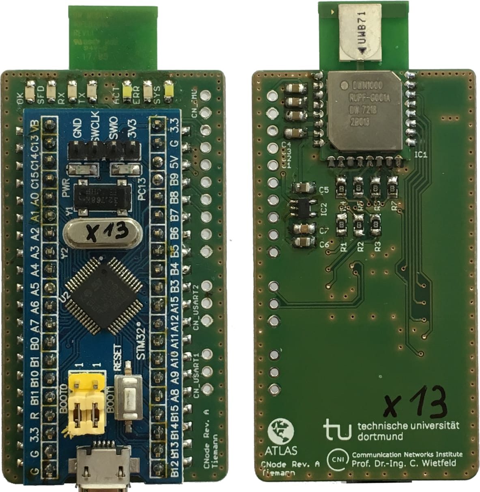
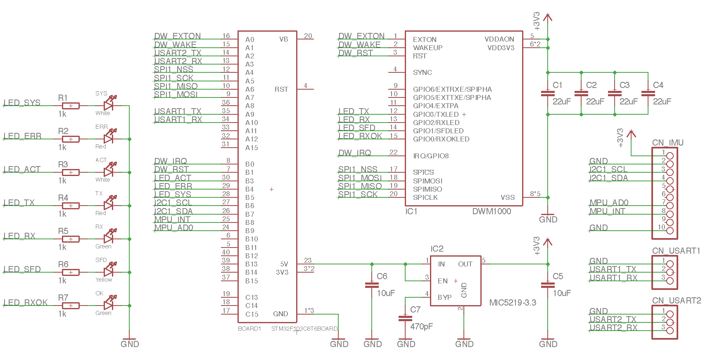

hw-altas-node
================

This is a minimal node PCB for the DecaWave DWM1000 module and the STM32 Blue-Pill.
The main MCU is a STM32F103C8T6.

Project schematic:

## BOM
| Identifier | Type/Value | Quantity | Supplier Id | Supplier | Comment |
| ---        | ---        | ---      | ---         | ---      | ---     |
| R1-R7 | 10 kΩ | 7 | RND 0805 1 1,0K | [Reichelt][reichelt] |
| C7 | 470 pF | 1 | NPO-G0805 470P | [Reichelt][reichelt] |
| C5, C6 | 10 µF | 2 | RND 1500805X1062 | [Reichelt][reichelt] |
| C1-C4 | 22 µF | 4 | X5R 0805 DB 22U | [Reichelt][reichelt] |
| LED_SYS | LED white | 1 | SLO SMD-W0805-0 | [Reichelt][reichelt] |
| LED_ERR | LED red | 1 | OSO LHR974 | [Reichelt][reichelt] |
| LED_SYS | LED white | 1 | SLO SMD-W0805-0 | [Reichelt][reichelt] |
| LED_TX | LED red | 1 | OSO LHR974 | [Reichelt][reichelt] |
| LED_RX | LED green | 1 | OSO LGR971 | [Reichelt][reichelt] |
| LED_SFD | LED yellow | 1 | RND 135-00051 | [Reichelt][reichelt] |
| LED_OK | LED green | 1 | OSO LGR971 | [Reichelt][reichelt] |
| IC1 | DWM1000 | 1 | 1479-1002-1-ND | [Digikey][digikey] |
| IC2 | MIC5219-3.3 | 1 | - | [Aliexpress][aliexpress] |
| BOARD1 | STM32 Eval Board | 1 | - | [Aliexpress][aliexpress] |

[reichelt]: http://www.reichelt.de
[mouser]: http://mouser.com
[aliexpress]: http://www.aliexpress.com
[digikey]: http://www.digikey.de
